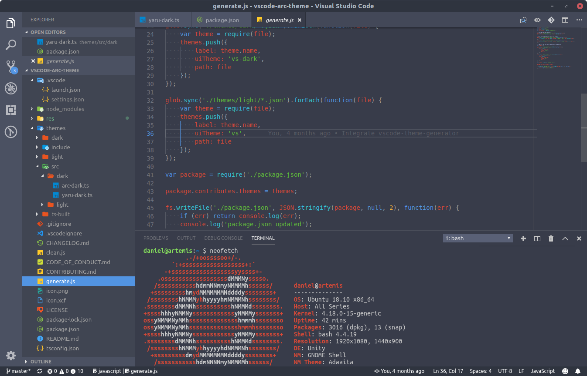
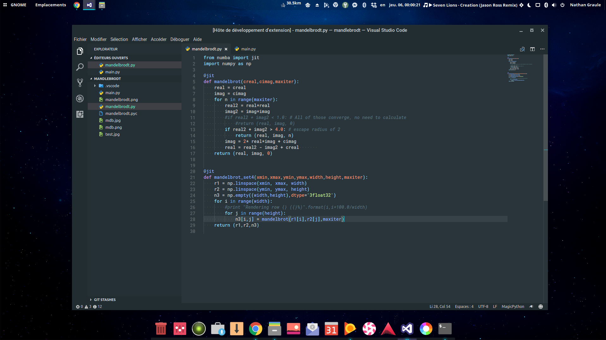
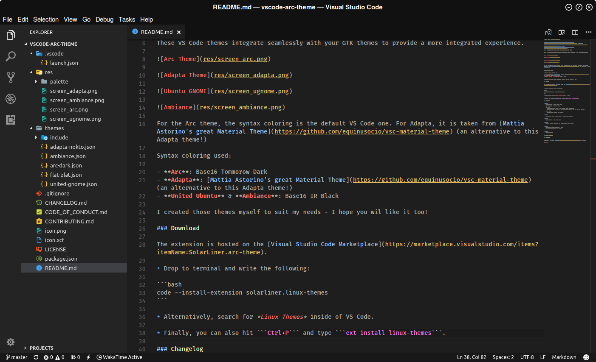
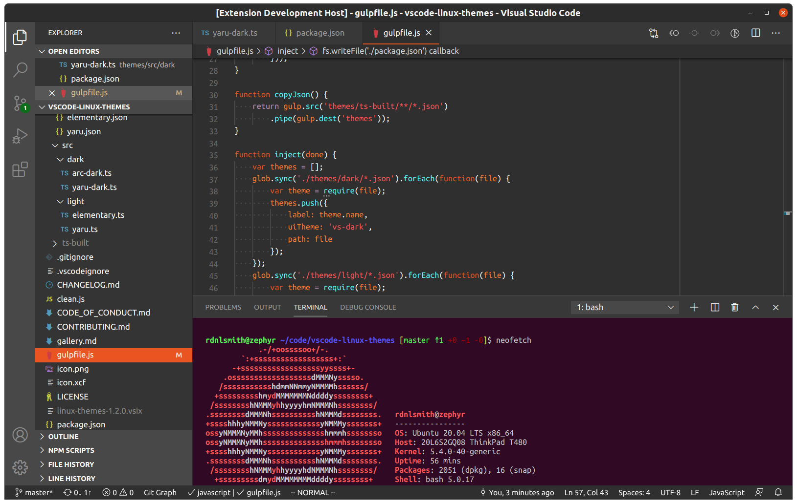
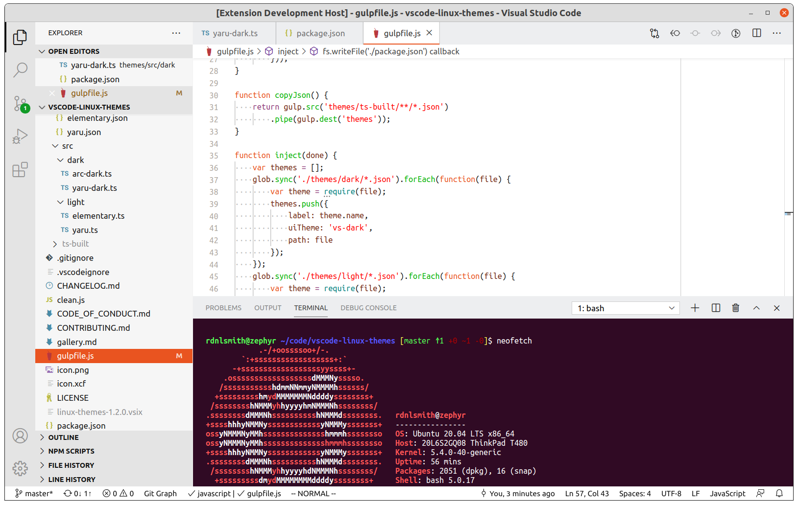

# Linux Themes for Visual Studio Code

[](https://raw.githubusercontent.com/rdnlsmith/vscode-arc-theme/master/LICENSE) [](https://marketplace.visualstudio.com/items?itemName=rdnlsmith.linux-themes) [](https://github.com/rdnlsmith/vscode-arc-theme/issues)
## Integrated color themes for the most popular Linux GTK themes

These VS Code themes blend seamlessly with your GTK themes to provide a more integrated experience.











Syntax coloring used:

- **Adapta**: [Mattia Astorino's great Material Theme](https://github.com/equinusocio/vsc-material-theme) (an alternative to this Adapta theme!)
- **United Ubuntu** & **Ambiance**: Base16 IR Black

### Download

The extension is hosted on the [Visual Studio Code Marketplace](https://marketplace.visualstudio.com/items?itemName=rdnlsmith.linux-themes).

* Drop to terminal and write the following:

```bash
code --install-extension rdnlsmith.linux-themes
```

* Alternatively, search for *Linux Themes* inside of VS Code.

* Finally, you can also hit ```Ctrl+P``` and type ```ext install linux-themes```.

### Changelog

See [CHANGELOG.md](./CHANGELOG.md) for historical changelogs.

## Follow development

### Contribute

Head over to the [GitHub Repository](https://github.com/rdnlsmith/vscode-arc-theme) to contribute.

**Enjoy!**
