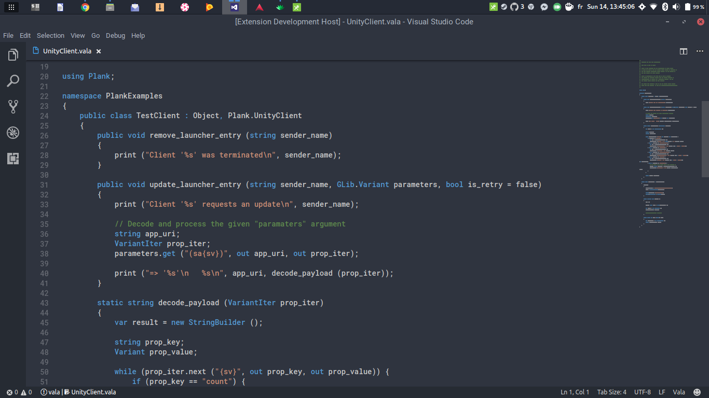
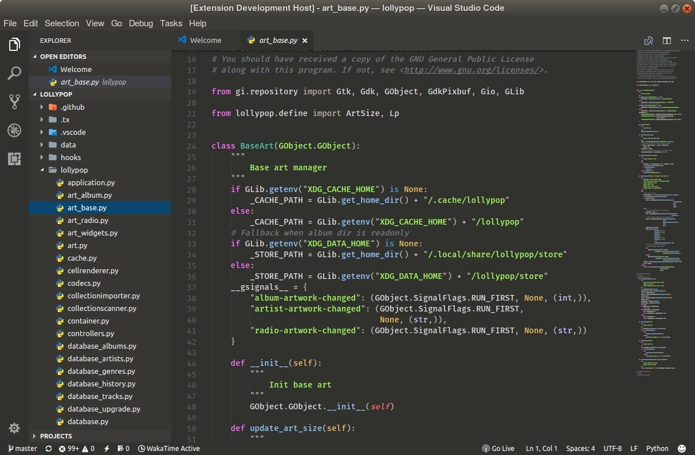

# Linux Themes for Visual Studio Code

[](https://raw.githubusercontent.com/SolarLiner/vscode-arc-theme/master/LICENSE) [](https://marketplace.visualstudio.com/items?itemName=SolarLiner.arc-theme) [](https://github.com/SolarLiner/vscode-arc-theme/issues)
## An integrated color theme for the most popular Linux GTK themes

These VS Code themes integrate seamlessly with your GTK themes to provide a more integrated experience.






For the Arc theme, the syntax coloring is the default VS Code one. For Adapta, it is taken from [Mattia Astorino's great Material Theme](https://github.com/equinusocio/vsc-material-theme) (an alternative to this Adapta theme!)

Syntax coloring used:

- **Arc**: Base16 Tommorow Dark
- **Adapta**: [Mattia Astorino's great Material Theme](https://github.com/equinusocio/vsc-material-theme) (an alternative to this Adapta theme!)
- **United Ubuntu** & **Ambiance**: Base16 IR Black

I created those themes myself to suit my needs - I hope you wil like it too!

### Download

The extension is hosted on the [Visual Studio Code Marketplace](https://marketplace.visualstudio.com/items?itemName=SolarLiner.arc-theme).

* Drop to terminal and write the following:

```bash
code --install-extension solarliner.linux-themes
```

* Alternatively, search for *Linux Themes* inside of VS Code.

* Finally, you can also hit ```Ctrl+P``` and type ```ext install linux-themes```.

### Changelog

* v1.0.0:
  * Initial release of United Ubuntu theme
  * Initial release of Ambiance theme
  * Arc theme:
    * Added Tomorrow token colors to Arc theme for better looking code
    * Sidebar is now the same color as the activity bar, making it look more like the Files app
  * Adapta theme:
    * Added colors on debugging and toolbars

* v0.5.0:
  * Changed token colors on Adapta theme to match Mattia Astorino's

* v0.4.0:
  * Initial release of the Adapta theme

* v0.3.0:
  * Directly included tokenColors from default Dark and Dark+ themes.

* v0.2.0:
  * Changed base syntax coloring to VS Dark+
  * Made selection highlight more visible

* v0.1.0:
  * README.md updates

## Follow development

### Contribute

Head over to the [GitHub Repository](https://github.com/SolarLiner/vscode-arc-theme) to contribute.

**Enjoy!**
